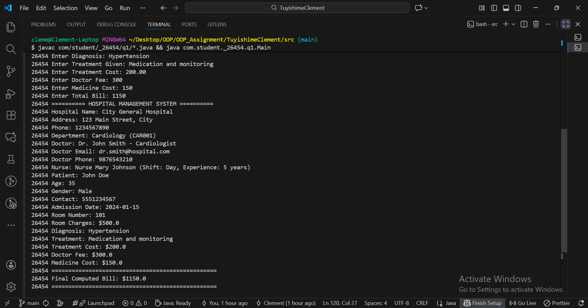

# OOP Assignment - Tuyishime Clement

**Student ID:** 26454  
**Name:** Tuyishime Clement  
**Project Name:** TuyishimeClement

## Project Structure

This project contains 10 OOP exercises, each demonstrating inheritance, encapsulation, and validation.

### Package Structure

- Package: `com.student._26454`
- Sub-packages: `q1`, `q2`, `q3`, `q4`, `q5`, `q6`, `q7`, `q8`, `q9`, `q10`

### Questions Implemented

1. **Q1: Hospital Management System**

   - Classes: Entity → Hospital → Department → Doctor → Nurse → Patient → Admission → Treatment → Bill → HospitalRecord
   - Method: `generateBill()`

2. **Q2: School Management System**

   - Classes: Entity → School → Department → Teacher → Student → Course → Exam → Result → Fee → StudentRecord
   - Method: `calculateAverageMarks()`

3. **Q3: Employee Payroll System**

   - Classes: Entity → Company → Department → Manager → Employee → Attendance → Allowance → Deduction → Salary → PayrollRecord
   - Method: `calculateNetSalary()`

4. **Q4: Hotel Reservation System**

   - Classes: Entity → Hotel → Room → Customer → Booking → Service → Payment → Bill → Feedback → ReservationRecord
   - Method: `generateBill()`

5. **Q5: Vehicle Rental System**

   - Classes: Entity → Company → Branch → Vehicle → Customer → Rental → Charge → Payment → Invoice → RentalRecord
   - Method: `calculateTotalCharge()`

6. **Q6: Banking System**

   - Classes: Entity → Bank → Account → Customer → Transaction → Deposit → Withdrawal → Loan → Payment → AccountRecord
   - Method: `calculateInterest()`

7. **Q7: Real Estate Management System**

   - Classes: Entity → Agency → Agent → Property → Seller → Buyer → Agreement → Payment → Commission → RealEstateRecord
   - Method: `calculateCommission()`

8. **Q8: Library Management System**

   - Classes: Entity → Library → Section → Book → Member → Borrow → Fine → Payment → Record → LibraryRecord
   - Method: `calculateFine()`

9. **Q9: Airline Ticketing System**

   - Classes: Entity → Airline → Flight → Passenger → Seat → Ticket → Baggage → Payment → Invoice → TicketRecord
   - Method: `generateInvoice()`

10. **Q10: Online Shopping System**
    - Classes: Entity → Store → Category → Product → Customer → Order → Payment → Shipping → Invoice → OrderRecord
    - Method: `calculateTotalAmount()`

## Features

- ✅ Inheritance across 10 related classes per question
- ✅ Encapsulation with private fields and public getters/setters
- ✅ Constructor validation with custom exceptions
- ✅ Scanner-based user input
- ✅ Student ID (26454) prefix in all outputs
- ✅ All validations as per requirements

## Compilation and Execution

Each question has a `Main.java` file that can be compiled and run:

```bash
# Example for Q1
cd src
javac com/student/_26454/q1/*.java
java com.student._26454.q1.Main
```

## Notes

- All outputs are prefixed with student ID: **26454**
- Custom exceptions are thrown for invalid input
- All validations are implemented as per assignment requirements

## Output for question one


